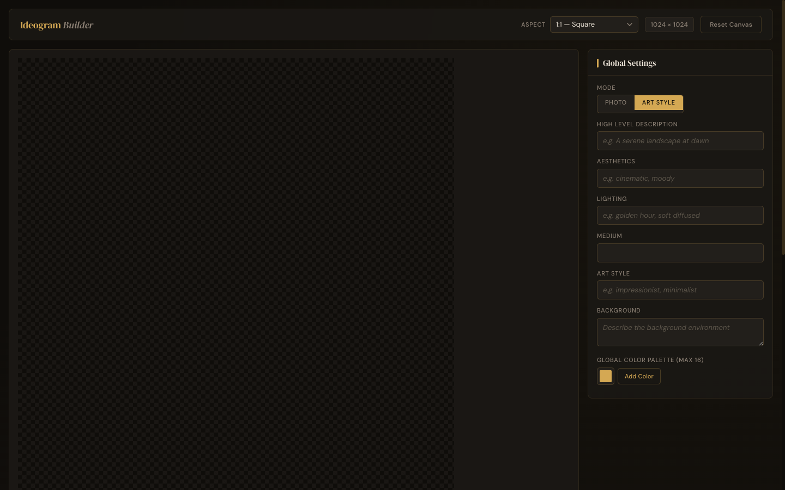
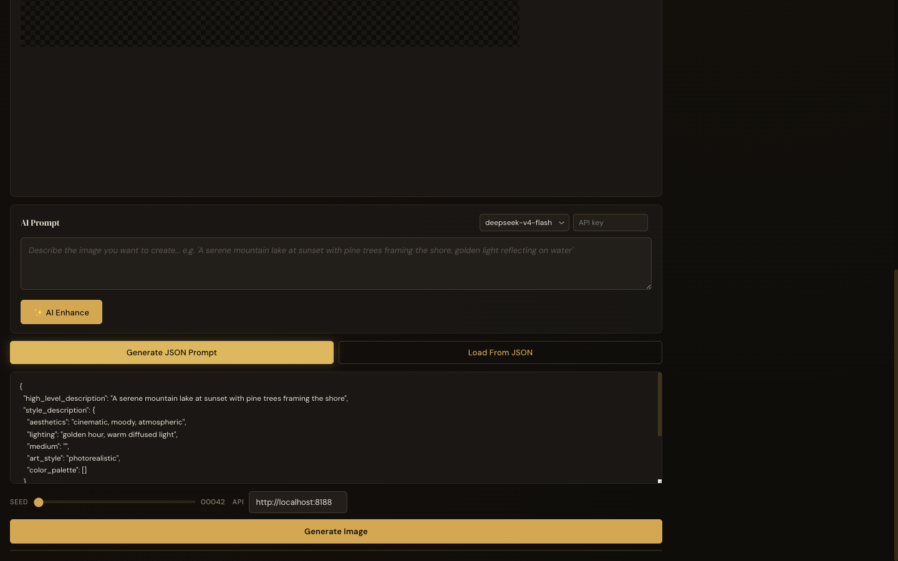

# Ideogram Builder

Visual prompt builder for [Ideogram4](https://ideogram.ai/) JSON image generation. Canvas-based bounding box editor with color palettes, ComfyUI integration, and PNG metadata import.




## Features

- **Canvas editor** — draw bounding boxes on a grid, drag/resize, assign labels
- **Color palettes** — add/remove swatches, auto-apply to selected boxes
- **JSON output** — live-generated Ideogram-compatible JSON prompt
- **PNG import** — drag-drop existing images, extract metadata and bounding boxes
- **ComfyUI integration** — send prompts directly to a running ComfyUI instance
- **AI prompt enhancer** — enhance prompts via LLM

## Quick Start

```bash
python3 server.py
```

Opens at `http://localhost:8000`. Server auto-loads LLM credentials from `~/.config/llm-credentials.json`.

## Tech Stack

Vanilla JS, no build tools. ES modules via `<script type="module">`.

## License

MIT
